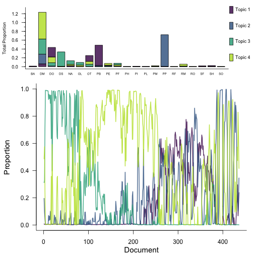
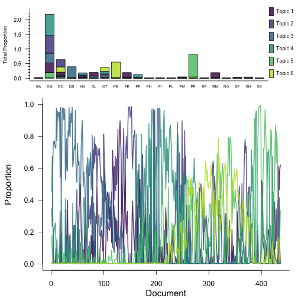
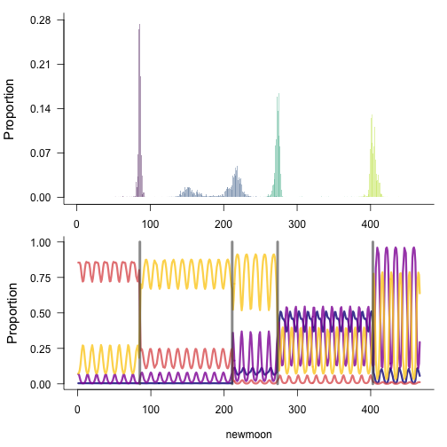
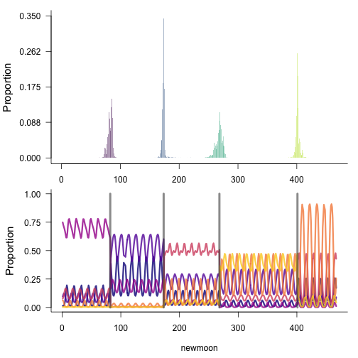
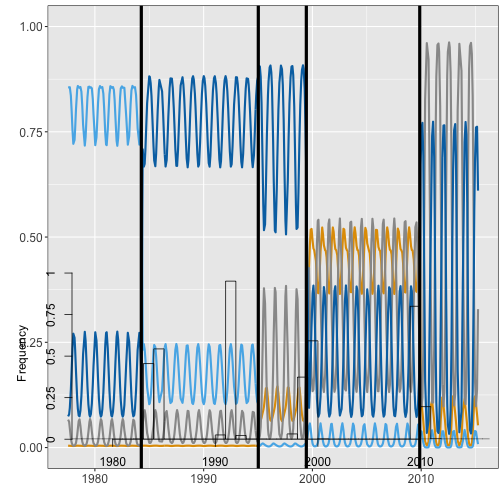
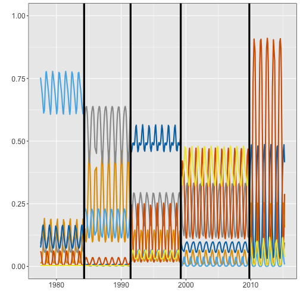

Side-by-side comparison of LDATS results with analysis from Christensen et al 2018. 

## LDATS Installation

To obtain the most recent version of **LDATS**, install the most recent 
version from GitHub:


```r
install.packages("devtools")
devtools::install_github("weecology/LDATS")
install.packages('here')
```


```r
library(LDATS)
```

## Christensen 2018 analysis files

Download Christensen 2018 analysis scripts & data files from [Extreme-events-LDA repo:](https://github.com/emchristensen/Extreme-events-LDA)

Main Analysis Scripts:

  * rodent_LDA_analysis.R main script for analyzing rodent community change using LDA
  
  * rodent_data_for_LDA.R contains a function that creates the rodent data table used in analyses
  
  * AIC_model_selection.R contains functions for calculating AIC for different candidate LDA models
  
  * changepointmodel.r contains change-point model code
  
  * LDA-distance.R function for computing Hellinger distance analyses
    
Data:

  * Rodent_table_dat.csv table of rodent data, created by rodent_data_for_LDA.R

Figure scripts:

  * LDA_figure_scripts.R contains functions for making main plots in manuscript (Fig 1). Called from rodent_LDA_analysis.R


```r

paper_filepath <- here::here('vignettes', 'christensenetal-comparison-files', 'christensenetal-2018-files')
test_filepath <- here::here('vignettes', 'christensenetal-ristensenetal-comparison-files', 'christensenetal-2018-files', 'rodent_LDA_analysis.r')

if(!file.exists(test_filepath)) {

files_to_download <- c('rodent_LDA_analysis.r', 'rodent_data_for_LDA.r', 'AIC_model_selection.R', 'changepointmodel.r', 'LDA-distance.R', 'Rodent_table_dat.csv', 'LDA_figure_scripts.R')

for(i in 1:length(files_to_download)) {
  download.file(url = paste0("https://raw.githubusercontent.com/emchristensen/Extreme-events-LDA/master/", files_to_download[i]),
                destfile = paste0(paper_filepath, '/', files_to_download[i]))
}

rm(files_to_download)
rm(i)

}

rm(test_filepath)
rm(paper_filepath)
```


## Data

The Portal rodents control data is included in the LDATS package:


```r

data(rodents)

head(rodents[[1]])
#>   BA DM DO DS NA. OL OT PB PE PF PH PI PL PM PP RF RM RO SF SH SO
#> 1  0 13  0  2   2  0  0  0  1  1  0  0  0  0  3  0  0  0  0  0  0
#> 2  0 20  1  3   2  0  0  0  0  4  0  0  0  0  2  0  0  0  0  0  0
#> 3  0 21  0  8   4  0  0  0  1  2  0  0  0  0  1  0  0  0  0  0  0
#> 4  0 21  3 12   4  2  3  0  1  1  0  0  0  0  0  0  0  0  0  0  0
#> 5  0 16  1  9   5  2  1  0  0  2  0  0  0  0  0  0  1  0  0  0  0
#> 6  0 17  1 13   5  1  5  0  0  3  0  0  0  0  0  0  0  0  0  0  0
```

Load the data used in Christensen et al: 


```r
source(here::here('vignettes', 'christensenetal-comparison-files', 'christensenetal-2018-files', 'rodent_data_for_LDA.r'))

dat = create_rodent_table(period_first = 1,
                          period_last = 436,
                          selected_plots = c(2,4,8,11,12,14,17,22),
                          selected_species = c('BA','DM','DO','DS','NA','OL','OT','PB','PE','PF','PH','PI','PL','PM','PP','RF','RM','RO','SF','SH','SO'))

# dates to go with count data
moondat = read.csv(text=getURL("https://raw.githubusercontent.com/weecology/PortalData/master/Rodents/moon_dates.csv"),stringsAsFactors = F)
moondat$date = as.Date(moondat$censusdate)

period_dates = filter(moondat,period %in% rownames(dat)) %>% select(period,date)
dates = period_dates$date

paper_dat <- dat

paper_dates <- dates

rm(list = c('dat', 'dates', 'period_dates',
            'create_rodent_table'))
```


Compare paper data to LDATS data:


```r

compare <- rodents[[1]] == paper_dat

length(which(rowSums(compare) < ncol(compare)))
#> [1] 16
```


There are 16 rows where the data included in LDATS differs from the paper data. This is because the LDATS data is not adjusted to account for trapping effort, but the paper data has divided all census counts by the actual number of plots trapped and multiplied by 8 to account for incompletely-trapped censuses. 

To confirm this, refer to lines 36-46 in `rodent_data_for_LDA.r`:

```
# retrieve data on number of plots trapped per month
  trap_table = read.csv('https://raw.githubusercontent.com/weecology/PortalData/master/Rodents/Portal_rodent_trapping.csv')
  trap_table_controls = filter(trap_table, plot %in% selected_plots)
  nplots_controls = aggregate(trap_table_controls$sampled,by=list(period = trap_table_controls$period),FUN=sum)
  
  # adjust species counts by number of plots trapped that month
  r_table_adjusted = as.data.frame.matrix(r_table)
  for (n in 1:436) {
    #divide by number of control plots actually trapped (should be 8) and multiply by 8 to estimate captures as if all plots were trapped
    r_table_adjusted[n,] = round(r_table_adjusted[n,]/nplots_controls$x[n]*8)
  }
  
    return(r_table_adjusted)

```  
 
Running the same procedure on the LDATS data, we modify 16 rows, and finish with a data frame that matches the one from the paper.


```r

trap_table = read.csv('https://raw.githubusercontent.com/weecology/PortalData/master/Rodents/Portal_rodent_trapping.csv')
  trap_table_controls =dplyr::filter(trap_table, plot %in% c(2,4,8,11,12,14,17,22))
  nplots_controls = aggregate(trap_table_controls$sampled,by=list(period = trap_table_controls$period),FUN=sum)
  
   # adjust species counts by number of plots trapped that month
  ldats_rodents_adjusted = as.data.frame.matrix(rodents[[1]])
  for (n in 1:436) {
    #divide by number of control plots actually trapped (should be 8) and multiply by 8 to estimate captures as if all plots were trapped
    ldats_rodents_adjusted[n,] = round(ldats_rodents_adjusted[n,]/nplots_controls$x[n]*8)
  }

  
compare_raw <- rodents[[1]] == ldats_rodents_adjusted
length(which(rowSums(compare_raw) < ncol(compare_raw)))
#> [1] 16

compare_adjusted <- ldats_rodents_adjusted == paper_dat
length(which(rowSums(compare_adjusted) < ncol(compare_adjusted)))
#> [1] 0
```


Because the LDA procedure weights the information from documents (census periods) according to the number of words (rodents captured), we now believe it is most appropriate to run the LDA on _unadjusted_ trapping data, and we recommend that users of LDATS do so. However, to maintain consistency with Christensen et al 2018, we will proceed using the _adjusted_ rodent table in this vignette. 


```r
rodents[[1]] <- paper_dat
```


The LDATS rodent data comes with a `document_covariate_table`, which we will use later as the predictor variables for the changepoint models. In this table, time is expressed as new moon numbers. Later we will want to be able to interpret the results in terms of census dates. We will add a column to the `document_covariate_table` to convert new moon numbers to census dates. We will not reference this column in any of the formulas we pass to the changepoint models, so it will be ignored until we need it.


```r

head(rodents$document_covariate_table)
#>   newmoon sin_year cos_year
#> 1       1  -0.2470  -0.9690
#> 2       2  -0.6808  -0.7325
#> 3       3  -0.9537  -0.3008
#> 4       4  -0.9813   0.1925
#> 5       5  -0.7583   0.6519
#> 6       6  -0.3537   0.9354

moondat <- dplyr::select(moondat, newmoonnumber, censusdate)
colnames(moondat) <- c('newmoon', 'censusdate')

new_cov_table <- dplyr::left_join(rodents$document_covariate_table, moondat, by = 'newmoon')

rodents$document_covariate_table <- new_cov_table
```


## Stage 1: LDA

While LDATS can run start-to-finish with `LDATS::LDA_TS`, here we will work through the process function-by-function to isolate differences with the paper. For an illustration of `LDA_TS`, see the `codebase` vignette.


```r

ldats_ldas <- LDATS::LDA_set(document_term_table = rodents$document_term_table, topics = c(2:6), nseeds = 100)
ldats_lda_selected <- LDATS::select_LDA(LDA_models = ldats_ldas)

save(ldats_ldas, file = here::here('vignettes', 'christensenetal-comparison-files', 'model-cache', 'ldats_ldas.Rds'))
save(ldats_lda_selected, file = here::here('vignettes', 'christensenetal-comparison-files', 'model-cache', 'ldats_lda_selected.Rds'))

```


Paper LDAS:


```r
source(here::here('vignettes', 'christensenetal-comparison-files', 'christensenetal-2018-files', 'AIC_model_selection.R'))
source(here::here('vignettes', 'christensenetal-comparison-files', 'christensenetal-2018-files', 'LDA-distance.R'))

# Fit a bunch of LDA models with different seeds
# Only use even numbers for seeds because consecutive seeds give identical results
seeds = 2*seq(200)

# repeat LDA model fit and AIC calculation with a bunch of different seeds to test robustness of the analysis
best_ntopic = repeat_VEM(paper_dat,
                         seeds,
                         topic_min=2,
                         topic_max=6)
hist(best_ntopic$k,breaks=c(0.5,1.5,2.5,3.5,4.5,5.5,6.5,7.5,8.5,9.5),xlab='best # of topics', main='')

# 2b. how different is species composition of 4 community-types when LDA is run with different seeds?
# ==================================================================
# get the best 100 seeds where 4 topics was the best LDA model
seeds_4topics = best_ntopic %>% 
  filter(k == 4) %>% 
  arrange(aic) %>% 
  head(100) %>% 
  pull(SEED)

# choose seed with highest log likelihood for all following analyses
#    (also produces plot of community composition for 'best' run compared to 'worst')
best_seed = calculate_LDA_distance(paper_dat,seeds_4topics)
mean_dist = unlist(best_seed)[2]
max_dist = unlist(best_seed)[3]

# ==================================================================
# 3. run LDA model
# ==================================================================
ntopics = 4
SEED = unlist(best_seed)[1]  # For the paper, use seed 206
ldamodel = LDA(paper_dat,ntopics, control = list(seed = SEED),method='VEM')

save(ldamodel,file = here::here('vignettes', 'christensenetal-comparison-files', 'model-cache', 'paper_ldamodel.Rds'))
```


### Plot LDAS


```r
# Paper
plot(ldamodel, cols = NULL, option = "D")
```



```r

# LDATS
plot(ldats_lda_selected[[1]], cols = NULL, option = "D")
```




The paper method finds 4 topics and LDATS finds 6. This is because of an update to the model selection procedure. The paper conservatively overestimates the number of parameters and therefore overpenalizes AIC for models with more topics. For this vignette, we will compare the results from using both LDA models. 


## Changepoint models

We will compare four combinations of LDA + changepoint models:

* LDATS LDA + LDATS changepoint
* LDATS LDA + paper changepoint
* Paper LDA + LDATS changepoint
* Paper LDA + paper changepoint

The paper changepoint model weighted all sample periods equally, wheras LDATS can weight sample periods according to how many individuals were captured (controlled by the `document_term_weights`). We now believe it is more appropriate to weight periods proportional to captures, and this is what we recommend for LDATS users. For the purposes of comparison, we will continue set all weights = 1 for both changepoint models. For an example of LDATS run with proportional weights, see the rodents vignette. [?]

### Running paper changepoint models

#### LDATS LDA and paper changepoint


```r

#### Load LDA ####
load(here::here('vignettes', 'christensenetal-comparison-files', 'model-cache', 'ldats_lda_selected.Rds'))
```


```r
#### Run changepoint ####
source(here::here('vignettes', 'christensenetal-comparison-files', 'christensenetal-2018-files', 'changepointmodel.r'))

# set up parameters for model
year_continuous = 1970 + as.integer(julian(paper_dates)) / 365.25
x = data.frame(
  year_continuous = year_continuous,
  sin_year = sin(year_continuous * 2 * pi),
  cos_year = cos(year_continuous * 2 * pi)
)

# run models with 1, 2, 3, 4, 5, 6 changepoints
cp_results_rodent = changepoint_model(ldats_lda_selected[[1]], x, 1, weights = rep(1,length(year_continuous)))
save(cp_results_rodent, file = here::here('vignettes', 'christensenetal-comparison-files', 'model-cache', 'ldats_paper_1.Rds'))
rm(cp_results_rodent)

cp_results_rodent2 = changepoint_model(ldats_lda_selected[[1]], x, 2, weights = rep(1,length(year_continuous)))
save(cp_results_rodent2, file = here::here('vignettes', 'christensenetal-comparison-files', 'model-cache', 'ldats_paper_2.Rds'))
rm(cp_results_rodent2)

cp_results_rodent3 = changepoint_model(ldats_lda_selected[[1]], x, 3, weights = rep(1,length(year_continuous)))
save(cp_results_rodent3, file = here::here('vignettes', 'christensenetal-comparison-files', 'model-cache', 'ldats_paper_3.Rds'))
rm(cp_results_rodent3)

cp_results_rodent4 = changepoint_model(ldats_lda_selected[[1]], x, 4, weights = rep(1,length(year_continuous)))
save(cp_results_rodent4, file = here::here('vignettes', 'christensenetal-comparison-files', 'model-cache', 'ldats_paper_4.Rds'))
rm(cp_results_rodent4)

cp_results_rodent5 = changepoint_model(ldats_lda_selected[[1]], x, 5, weights = rep(1,length(year_continuous)))
save(cp_results_rodent5, file = here::here('vignettes', 'christensenetal-comparison-files', 'model-cache', 'ldats_paper_5.Rds'))
rm(cp_results_rodent5)

cp_results_rodent6 = changepoint_model(ldats_lda_selected[[1]], x, 6, weights = rep(1,length(year_continuous)))
save(cp_results_rodent6, file = here::here('vignettes', 'christensenetal-comparison-files', 'model-cache', 'ldats_paper_6.Rds'))
rm(cp_results_rodent6)
```


```r
#### Changepoint model selection ####
load(here::here('vignettes', 'christensenetal-comparison-files', 'model-cache', 'ldats_paper_1.Rds'))
load(here::here('vignettes', 'christensenetal-comparison-files', 'model-cache', 'ldats_paper_2.Rds'))
load(here::here('vignettes', 'christensenetal-comparison-files', 'model-cache', 'ldats_paper_3.Rds'))
load(here::here('vignettes', 'christensenetal-comparison-files', 'model-cache', 'ldats_paper_4.Rds'))
load(here::here('vignettes', 'christensenetal-comparison-files', 'model-cache', 'ldats_paper_5.Rds'))
load(here::here('vignettes', 'christensenetal-comparison-files', 'model-cache', 'ldats_paper_6.Rds'))

ntopics = ldats_lda_selected[[1]]@k

# change point model selection
# mean deviance ( -2 * log likelihood) + 2*(#parameters)
mean(cp_results_rodent$saved_lls * -2) + 2*(3*(ntopics-1)*(1+1)+(1))
#> [1] 1340.817
mean(cp_results_rodent2$saved_lls * -2)+ 2*(3*(ntopics-1)*(2+1)+(2))
#> [1] 1306.495
mean(cp_results_rodent3$saved_lls * -2)+ 2*(3*(ntopics-1)*(3+1)+(3))
#> [1] 1285.447
mean(cp_results_rodent4$saved_lls * -2)+ 2*(3*(ntopics-1)*(4+1)+(4))
#> [1] 1276.232
mean(cp_results_rodent5$saved_lls * -2)+ 2*(3*(ntopics-1)*(5+1)+(5))
#> [1] 1287.485
mean(cp_results_rodent6$saved_lls * -2)+ 2*(3*(ntopics-1)*(6+1)+(6))
#> [1] 1302.126

# The lowest deviance is for 4 changepoints. 


df_4 = as.data.frame(t(cp_results_rodent4$saved[,1,])) %>% reshape::melt()
#> Using  as id variables
year_continuous = 1970 + as.integer(julian(paper_dates)) / 365.25
df_4$value = year_continuous[df_4$value]


ldats_paper_cpt_dates <- vector(length = 4)
ldats_paper_cpt_dates[1] <- mean(df_4[df_4$variable=='V1','value']) %>% lubridate::date_decimal() %>% format('%Y-%m-%d')
ldats_paper_cpt_dates[2] <-mean(df_4[df_4$variable=='V2','value']) %>% lubridate::date_decimal() %>% format('%Y-%m-%d')
ldats_paper_cpt_dates[3] <-mean(df_4[df_4$variable=='V3','value']) %>% lubridate::date_decimal() %>% format('%Y-%m-%d')
ldats_paper_cpt_dates[4] <-mean(df_4[df_4$variable=='V4','value']) %>% lubridate::date_decimal() %>% format('%Y-%m-%d')

ldats_paper_cpt_dates
#> [1] "1984-01-10" "1991-06-03" "1999-01-03" "2009-11-07"
```


#### Paper LDA and paper changepoint


```r

#### Load LDA ####
load(here::here('vignettes', 'christensenetal-comparison-files', 'model-cache', 'paper_ldamodel.Rds'))
```


```r
#### Run changepoint ####
source(here::here('vignettes', 'christensenetal-comparison-files', 'christensenetal-2018-files', 'changepointmodel.r'))

# set up parameters for model
year_continuous = 1970 + as.integer(julian(paper_dates)) / 365.25
x = data.frame(
  year_continuous = year_continuous,
  sin_year = sin(year_continuous * 2 * pi),
  cos_year = cos(year_continuous * 2 * pi)
)

# run models with 1, 2, 3, 4, 5, 6 changepoints
cp_results_rodent = changepoint_model(ldamodel, x, 1, weights = rep(1,length(year_continuous)))
save(cp_results_rodent, file = here::here('vignettes', 'christensenetal-comparison-files', 'model-cache', 'paper_paper1.Rds'))
rm(cp_results_rodent)

cp_results_rodent2 = changepoint_model(ldamodel, x, 2, weights = rep(1,length(year_continuous)))
save(cp_results_rodent2, file = here::here('vignettes', 'christensenetal-comparison-files', 'model-cache', 'paper_paper2.Rds'))
rm(cp_results_rodent2)

cp_results_rodent3 = changepoint_model(ldamodel, x, 3, weights = rep(1,length(year_continuous)))
save(cp_results_rodent3, file = here::here('vignettes', 'christensenetal-comparison-files', 'model-cache', 'paper_paper3.Rds'))
rm(cp_results_rodent3)

cp_results_rodent4 = changepoint_model(ldamodel, x, 4, weights = rep(1,length(year_continuous)))
save(cp_results_rodent4, file = here::here('vignettes', 'christensenetal-comparison-files', 'model-cache', 'paper_paper4.Rds'))
rm(cp_results_rodent4)

cp_results_rodent5 = changepoint_model(ldamodel, x, 5, weights = rep(1,length(year_continuous)))
save(cp_results_rodent5, file = here::here('vignettes', 'christensenetal-comparison-files', 'model-cache', 'paper_paper5.Rds'))
rm(cp_results_rodent5)

cp_results_rodent6 = changepoint_model(ldamodel, x, 6, weights = rep(1,length(year_continuous)))
save(cp_results_rodent6, file = here::here('vignettes', 'christensenetal-comparison-files', 'model-cache', 'paper_paper6.Rds'))
rm(cp_results_rodent6)
```


```r
#### Changepoint model selection ####
load(here::here('vignettes', 'christensenetal-comparison-files', 'model-cache', 'paper_paper_1.Rds'))
load(here::here('vignettes', 'christensenetal-comparison-files', 'model-cache', 'paper_paper_2.Rds'))
load(here::here('vignettes', 'christensenetal-comparison-files', 'model-cache', 'paper_paper_3.Rds'))
load(here::here('vignettes', 'christensenetal-comparison-files', 'model-cache', 'paper_paper_4.Rds'))
load(here::here('vignettes', 'christensenetal-comparison-files', 'model-cache', 'paper_paper_5.Rds'))
load(here::here('vignettes', 'christensenetal-comparison-files', 'model-cache', 'paper_paper_6.Rds'))

ntopics = ldamodel@k

# change point model selection
# mean deviance ( -2 * log likelihood) + 2*(#parameters)
mean(cp_results_rodent$saved_lls * -2) + 2*(3*(ntopics-1)*(1+1)+(1))
#> [1] 898.5209
mean(cp_results_rodent2$saved_lls * -2)+ 2*(3*(ntopics-1)*(2+1)+(2))
#> [1] 834.8776
mean(cp_results_rodent3$saved_lls * -2)+ 2*(3*(ntopics-1)*(3+1)+(3))
#> [1] 818.1249
mean(cp_results_rodent4$saved_lls * -2)+ 2*(3*(ntopics-1)*(4+1)+(4))
#> [1] 813.6164
mean(cp_results_rodent5$saved_lls * -2)+ 2*(3*(ntopics-1)*(5+1)+(5))
#> [1] 817.8308
mean(cp_results_rodent6$saved_lls * -2)+ 2*(3*(ntopics-1)*(6+1)+(6))
#> [1] 826.4913

# The lowest deviance is for 4 changepoints. 

df_4 = as.data.frame(t(cp_results_rodent4$saved[,1,])) %>%  reshape::melt()
#> Using  as id variables
df_4$value = year_continuous[df_4$value]


paper_paper_cpt_dates <- vector(length = 4)
paper_paper_cpt_dates[1] <- mean(df_4[df_4$variable=='V1','value']) %>% lubridate::date_decimal() %>% format('%Y-%m-%d')
paper_paper_cpt_dates[2] <-mean(df_4[df_4$variable=='V2','value']) %>% lubridate::date_decimal() %>% format('%Y-%m-%d')
paper_paper_cpt_dates[3] <-mean(df_4[df_4$variable=='V3','value']) %>% lubridate::date_decimal() %>% format('%Y-%m-%d')
paper_paper_cpt_dates[4] <-mean(df_4[df_4$variable=='V4','value']) %>% lubridate::date_decimal() %>% format('%Y-%m-%d')

paper_paper_cpt_dates
#> [1] "1984-04-14" "1992-11-24" "1999-05-29" "2010-01-01"
```


### Running LDATS changepoint models

#### LDATS LDA and LDATS changepoint


```r

#### Load LDA ####
load(here::here('vignettes', 'christensenetal-comparison-files', 'model-cache', 'ldats_lda_selected.Rds'))
```
#### Run the TS models


```r
#### Run LDATS changepoint ####

ldats_ldats_cpt <- TS_on_LDA(LDA_models = ldats_lda_selected, 
                             document_covariate_table = rodents$document_covariate_table,
                             formulas = ~ sin_year + cos_year,
                             nchangepoints = 1:6,
                             weights = NULL)


save(ldats_ldats_cpt, file = here::here('vignettes', 'christensenetal-comparison-files', 'model-cache', 'ldats_ldats.Rds'))
rm(ldats_ldats_cpt)
rm(ldats_lda_selected)
```


### Select model


```r

ldats_ldats_cpt_selected <- select_TS(ldats_ldats_cpt)

ldats_ldats_cpt_selected$nchangepoints
#> [1] 4
```

### Get dates associated with changepoints


```r
ldats_ldats_cpt_dates <- ldats_ldats_cpt_selected$rho_summary$Mean
ldats_ldats_cpt_dates <- round(ldats_ldats_cpt_dates)

ldats_ldats_cpt_dates <- as.data.frame(ldats_ldats_cpt_dates)
colnames(ldats_ldats_cpt_dates) <- 'newmoon'
ldats_ldats_cpt_dates <- dplyr::left_join(ldats_ldats_cpt_dates, rodents$document_covariate_table, by = 'newmoon')
ldats_ldats_cpt_dates <- ldats_ldats_cpt_dates$censusdate
```


### Paper LDA and LDATS changepoint


```r

#### Load LDA ####
load(here::here('vignettes', 'christensenetal-comparison-files', 'model-cache', 'paper_ldamodel.Rds'))
```
#### Run the TS models


```r
#### Run LDATS changepoint ####

paper_ldats_cpt <- TS_on_LDA(LDA_models = ldamodel, 
                             document_covariate_table = rodents$document_covariate_table,
                             formulas = ~ sin_year + cos_year,
                             nchangepoints = 1:6,
                             weights = NULL)


save(paper_ldats_cpt, file = here::here('vignettes', 'christensenetal-comparison-files', 'model-cache', 'paper_ldats.Rds'))
rm(paper_ldats_cpt)
rm(ldamodel)
```


### Select model


```r

paper_ldats_cpt_selected <- select_TS(paper_ldats_cpt)

paper_ldats_cpt_selected$nchangepoints
#> [1] 4
```

#### Get dates

Unlike the paper changepoint model, LDATS can recognize that sampling periods may not be equidistant, and can place changepoint estimates at new moons if they fall between nonconsecutive sampling periods. We can estimate the dates corresponding to those new moons. 


```r
paper_ldats_cpt_dates <- paper_ldats_cpt_selected$rho_summary$Mean
paper_ldats_cpt_dates <- round(paper_ldats_cpt_dates)

paper_ldats_cpt_dates <- as.data.frame(paper_ldats_cpt_dates)
colnames(paper_ldats_cpt_dates) <- 'newmoon'
paper_ldats_cpt_dates <- dplyr::left_join(paper_ldats_cpt_dates, rodents$document_covariate_table, by = 'newmoon')

halfinterval = as.integer((as.Date(rodents$document_covariate_table$censusdate[ which(rodents$document_covariate_table$newmoon == paper_ldats_cpt_dates$newmoon[1] + 1)]) - as.Date(rodents$document_covariate_table$censusdate[ which(rodents$document_covariate_table$newmoon == paper_ldats_cpt_dates$newmoon[1] - 1)]))/2)

newdate <- lubridate::ymd(rodents$document_covariate_table$censusdate[ which(rodents$document_covariate_table$newmoon == paper_ldats_cpt_dates$newmoon[1] -1 )]) + lubridate::days(halfinterval)

paper_ldats_cpt_dates$censusdate[1] <- as.character(newdate)


halfinterval =as.integer((as.Date(rodents$document_covariate_table$censusdate[ which(rodents$document_covariate_table$newmoon == paper_ldats_cpt_dates$newmoon[3] + 2)]) - as.Date(rodents$document_covariate_table$censusdate[ which(rodents$document_covariate_table$newmoon == paper_ldats_cpt_dates$newmoon[3] - 1)]))/3)

newdate <- lubridate::ymd(rodents$document_covariate_table$censusdate[ which(rodents$document_covariate_table$newmoon == paper_ldats_cpt_dates$newmoon[3] -2 )]) + lubridate::days(halfinterval)

paper_ldats_cpt_dates$censusdate[3] <- as.character(newdate)

paper_ldats_cpt_dates <- paper_ldats_cpt_dates$censusdate
```


All of the models find four changepoints.


```r
cpt_dates
#>   paperLDA_papercpt ldatsLDA_papercpt ldatsLDA_ldatscpt paperLDA_ldatscpt
#> 1        1984-04-14        1984-01-10        1984-02-04        1984-05-03
#> 2        1992-11-24        1991-06-03        1991-06-13        1993-04-23
#> 3        1999-05-29        1999-01-03        1999-01-16        1999-06-14
#> 4        2010-01-01        2009-11-07        2009-11-14        2010-01-16
```

The choice of LDA has more influence on the changepoint locations than the choice of changepoint model - probably because the LDATS LDA has 6 topics, and the paper LDA has 4.


### Plot changepoint models


```r

plot(paper_ldats_cpt_selected)
```



```r

plot(ldats_ldats_cpt_selected)
```



```r


source(here::here('vignettes', 'christensenetal-comparison-files', 'christensenetal-2018-files', 'LDA_figure_scripts.R'))
source(here::here('vignettes', 'christensenetal-comparison-files', 'christensenetal-2018-files', 'changepointmodel.r'))
paper_cpts = find_changepoint_location(paper_paper_cpt_selected)
paper_cpt_plot = get_ll_non_memoized_plot(ldamodel,x,paper_cpts,make_plot=T,weights=rep(1,length(year_continuous)))
annual_hist(paper_paper_cpt_selected, year_continuous)
paper_cpt_plot

ntopics = 6
ldats_cpts = find_changepoint_location(ldats_paper_cpt_selected)
ldats_cpt_plot = get_ll_non_memoized_plot(ldats_lda_selected[[1]],x,ldats_cpts,make_plot=T,weights=rep(1,length(year_continuous)))
annual_hist(ldats_paper_cpt_selected, year_continuous)
```



```r
ldats_cpt_plot
```


